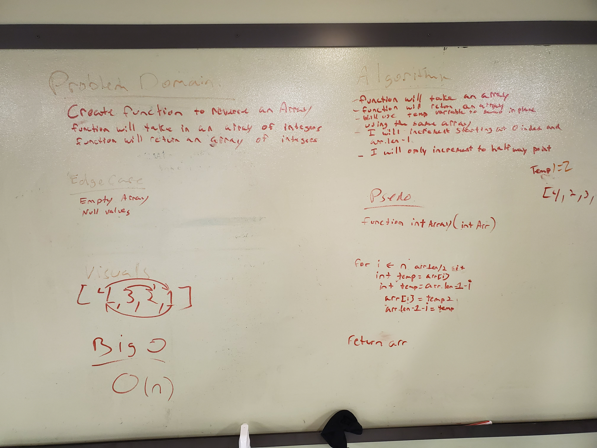
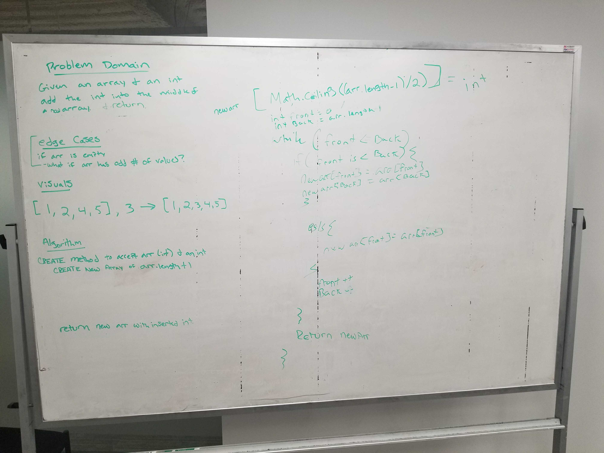

#This will list all the coding challenges for 401

#First coding challenge
This function will take in an array and will return an array.
This function will be reversing an array in place modifing the same array.
I used a while loop to complete this feature.
I also used one temp variable.

#Second coding challenge
This is a function that will insert a integer into the center of an array

